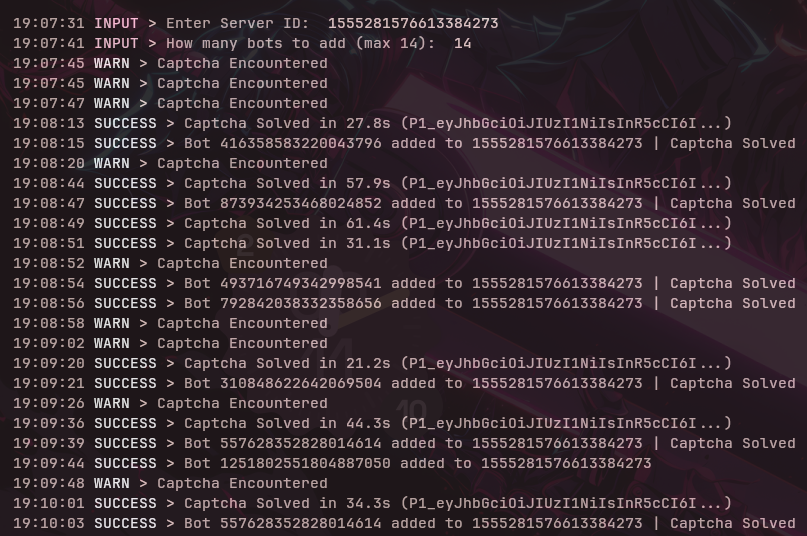

# Discord Mass Bot Adder



A fast, threaded Discord bot adder with hCaptcha Enterprise solving, TLS fingerprint spoofing, and Windows-accurate headers.

---

## Features

- Multi-threaded bot adding with configurable thread count
- Automatic hCaptcha Enterprise solving via [AnySolver](https://anysolver.com)
- TLS fingerprint spoofing through [tlsmask](https://github.com/Ubaidullah71/tlsmask)
- Windows-accurate headers and `x-super-properties`
- Proxy support per thread from `io/proxies.txt`
- Clean console output with timestamps

---

## Setup

**1. Install dependencies**
```
pip install -r requirements.txt
```

**2. Fill in `config.yml`**
```yaml
token: "YOUR_DISCORD_TOKEN"
threads: 3
solver:
  service: "anysolver"     # anysolver or ragecaptcha
  api_key: "YOUR_API_KEY"
  subservice: ""           # anysolver only, leave blank for ragecaptcha
```

`service` accepts `anysolver` (default) or `ragecaptcha`. The `subservice` field is only used by AnySolver — leave it empty when using RageCaptcha.

**3. Populate input files**

`io/botid.txt` — one bot client ID per line:
```
123456789012345678
987654321098765432
```

`io/proxies.txt` — one proxy per line (optional, used for captcha solving):
```
user:pass@host:port
host:port
```

**4. Run**
```
python main.py
```

---

## File Structure

```
Discord-Bot-Adder/
├── main.py
├── config.yml
└── io/
    ├── botid.txt
    └── proxies.txt
```

---

## Notes

- The account used must have **Administrator** permission in the target server
- Keep threads low (2–4) to avoid rate limits
- Proxies are assigned round-robin across threads

---

## Credits

- [tlsmask](https://github.com/Ubaidullah71/tlsmask) — TLS client hello fingerprinting wrapper used for Chrome-accurate session spoofing
- [AnySolver](https://anysolver.com) — hCaptcha Enterprise solving service
- [RageCaptcha](https://ragecaptcha.com) — hCaptcha Enterprise solving service

---

## Support

- [Mascular Mart](https://discord.gg/b4y)
